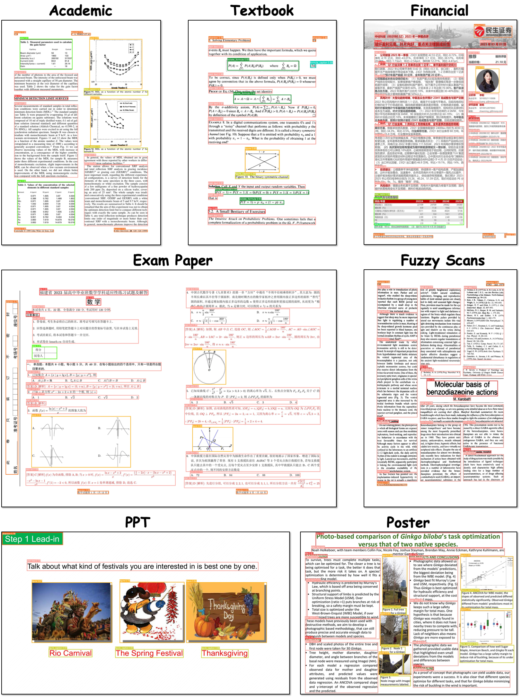

<div align="center">


<h1>DocLayout-YOLO: Towards Robust and Efficient Document Layout Analysis through Diverse Document Synthesis and Perception Enhancement</h1>

</div>
    
## Abstract

> We present DocLayout-YOLO, a real-time and robust layout detection model for diverse documents, based on YOLO-v10. This model is enriched with diversified document pre-training and structural optimization tailored for layout detection. In the pre-training phase, we introduce Mesh-candidate BestFit, viewing document synthesis as a two-dimensional bin packing problem, and create two large-scale diverse synthetic document dataset, DocSynth-1M, DocSynth-300K. In terms of model structural optimization, we propose a module with Global-to-Local Controllability for precise detection of document elements across varying scales. 


<p align="center">
  
   <br>
</p>


## Quick Start

### 1. Environment Setup

Follow these steps to set up your environment:

```bash
conda env create -f environment.yml
conda activate doclayout_yolo
pip install -e .
```

### 2. Prediction

You can make predictions using either a script or the SDK. For your cpnvenience, we provide model fine-tuned on **DocStructBench** for prediction, **which is capable of handing various document types**. Model can be downloaded from [doclayout_yolo_docstructbench_imgsz1280.pt](https://huggingface.co/anonymous-iccv1968/DocLayout-YOLO-DocStructBench/resolve/main/doclayout_yolo_docstructbench_imgsz1280.pt?download=true) and example images can be found under ```assets/example```.

- **Script**

  Run the following command to make a prediction using the script:

  ```bash
  python demo.py --model path/to/model --image-path path/to/image
  ```

- **SDK**

  Here is an example of how to use the SDK for prediction:

  ```python
  import cv2
  from doclayout_yolo import YOLOv10

  # Load the pre-trained model
  model = YOLOv10("path/to/provided/model")

  # Perform prediction
  det_res = model.predict(
      "path/to/image",   # Image to predict
      imgsz=1024,        # Prediction image size
      conf=0.2,          # Confidence threshold
      device="cuda:0"    # Device to use (e.g., 'cuda:0' or 'cpu')
  )

  # Annotate and save the result
  annotated_frame = det_res[0].plot(pil=True, line_width=5, font_size=20)
  cv2.imwrite("result.jpg", annotated_frame)
  ```

- **Local Demo**

    Install gradio:
    
    ```bash
    pip install gradio==5.1.0
    pip install gradio-client==1.4.0
    ```
    
    Launch local demo:
    
    ```bash
    python app.py
    ```

<p align="center">
   <br>
</p>

## Training and Evaluation on Public DLA Datasets

### Data Preparation

1. Specify  the data root path

Find your ultralytics config file (for Linux user in ```$HOME/.config/Ultralytics/settings.yaml)``` and change ```datasets_dir``` to project root path.

2. Download data

use following provided script to download dataset into corresponding folder under ```./layout_data```. For example, if you want to download D4LA, use following commands:

```python
from huggingface_hub import snapshot_download 
snapshot_download(
    repo_id="anonymous-iccv1968/DocLayout_YOLO_D4LA_iccv1968", 
    repo_type="dataset", 
    local_dir="./layout_data/D4LA"
)
```

| PubLayNet | DocLayNet | D4LA | PRIMA-LAD | TableBank | Cord-v2 | WTW |
|:--:|:--:|:--:|:--:|:--:|:--:|:--:|
| [Huggingface](https://huggingface.co/datasets/anonymous-iccv1968/DocLayout_YOLO_PubLayNet_iccv1968) | [Huggingface](https://huggingface.co/datasets/anonymous-iccv1968/DocLayout_YOLO_DocLayNet_iccv1968) | [Huggingface](https://huggingface.co/datasets/anonymous-iccv1968/DocLayout_YOLO_D4LA_iccv1968) | [Huggingface](https://huggingface.co/datasets/anonymous-iccv1968/DocLayout_YOLO_PRIMA-LAD_iccv1968) | [Huggingface](https://huggingface.co/datasets/anonymous-iccv1968/DocLayout_YOLO_TableBank_iccv1968) | [Huggingface](https://huggingface.co/datasets/anonymous-iccv1968/DocLayout_YOLO_cord-v2_iccv1968) | [Huggingface](https://huggingface.co/datasets/anonymous-iccv1968/DocLayout_YOLO_WTW_iccv1968) |
 
3. Prepare downloaded data

then uncompress downloaded data using:

```shell
cat [dataset_name]_images.tar.gz.* | tar xzvf -
cat [dataset_name]_labels.tar.gz.* | tar xzvf -
```

the file structure is as follows:

```bash
./dataset_name
    ├── images 
    ├── labels
    ├── val.txt
    └── train.txt
```

```dataset_name```: name of dataset

```images```: folder contains all images, including training and evaluation

```labels```: folder contains all image labels, including training and evaluation. One ```.txt``` file for an image. For example, the label of ```test.jpg``` is ```test.txt```. In image label file, each file contains several space-seperated lines, each lines corresponds to a bounding box. Each line contains 

```txt
class[int] x0[float] y0[float] x1[float] y0[float] x1[float] y1[float] x0[float] y1[float]
```

for example:

```txt
1 0.2 0.2 0.2 0.5 0.5 0.5 0.5 0.2
```

```train.txt``` and ```val.txt```: a ```.txt``` file that contains all training or evaluation images. For example: 

```
aaa.jpg
bbb.jpg
...
```

### Training and Evaluation

Training is conducted on 8 GPUs with a global batch size of 64 (8 images per device). The detailed settings and checkpoints are as follows:

| Dataset | Document Type | Pretrain Data | Finetune | Evaluation | mAP | Checkpoint |
|:--:|:--:|:--:|:--:|:--:|:--:|:--:|:--:|
| PubLayNet | Academic Paper | DocSynth-1M | [command](assets/script.sh#L3) | [command](assets/script.sh#L7) | 96.9 | [checkpoint](https://huggingface.co/anonymous-iccv1968/DocLayout_YOLO_PubLayNet_iccv1968/blob/main/publaynet_best.pt) |
| DocLayNet | Multiple | DocSynth-1M | [command](assets/script.sh#L11) | [command](assets/script.sh#L15) | 83.4 | [checkpoint](https://huggingface.co/anonymous-iccv1968/DocLayout_YOLO_DocLayNet_iccv1968/blob/main/doclaynet_best.pt) |
| D4LA | Multiple (noisy) | DocSynth-300K | [command](assets/script.sh#L20) | [command](assets/script.sh#L23) | 70.9 | [checkpoint](https://huggingface.co/anonymous-iccv1968/DocLayout_YOLO_D4LA_iccv1968/blob/main/d4la_best.pt) |
| PRIMA-LAD | Magazine | DocSynth-1M | [command](assets/script.sh#L27) | [command](assets/script.sh#L31) | 70.3 | [checkpoint](https://huggingface.co/anonymous-iccv1968/DocLayout_YOLO_PRIMA-LAD_iccv1968/blob/main/prima_best.pt) |
| TableBank | Table | DocSynth-300K | [command](assets/script.sh#L36) | [command](assets/script.sh#L39) | 97.5 | [checkpoint](https://huggingface.co/anonymous-iccv1968/DocLayout_YOLO_TableBank_iccv1968/blob/main/tablebank_best.pt) |
| Cord-v2 | Recipe | DocSynth-300K | [command](assets/script.sh#L44) | [command](assets/script.sh#L47) | 98.4 | [checkpoint](https://huggingface.co/anonymous-iccv1968/DocLayout_YOLO_Cord-v2_iccv1968/blob/main/cordv2_best.pt) |
| WTW | Table Cell | DocSynth-1M | [command](assets/script.sh#L51) | [command](assets/script.sh#L55) | 76.1 | [checkpoint](https://huggingface.co/anonymous-iccv1968/DocLayout_YOLO_WTW_iccv1968/blob/main/wtw_best.pt) |

DocSynth pretrained models can be downloaded from here:

| Dataset | Pretrained Model |
|:--:|:--:|
| DocSynth300K | [checkpoint](https://huggingface.co/anonymous-iccv1968/DocLayout-YOLO-DocSynth300K-pretrain-iccv1968/blob/main/v10m-doclayout-docsynth300k.pt) |
| DocSynth1M | [checkpoint](https://huggingface.co/anonymous-iccv1968/DocLayout-YOLO-DocSynth1M-pretrain-iccv1968/blob/main/v10m-doclayout-docsynth1m.pt) |

**Note:**

1. The provided training and evaluation scripts runs with 8x GPUs by default, if you want to specify the device you can add ```--device```. For example, ```--device 0,1,2,3```.

## Acknowledgement

The code base is built with [ultralytics](https://github.com/ultralytics/ultralytics) and [YOLO-v10](https://github.com/lyuwenyu/RT-DETR).

Thanks for their great work!
